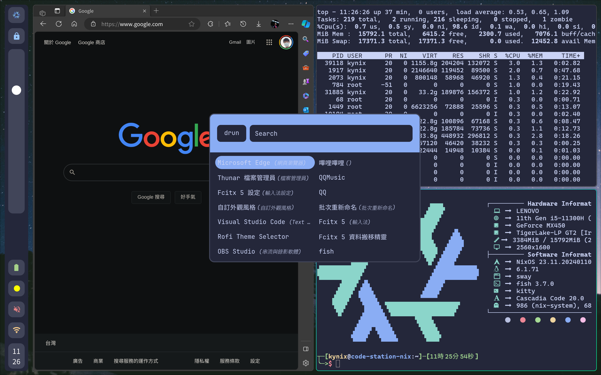

# Nix OS Configurations
English | <a href="./docs/README_ZH_TW.md">正體中文</a>

## Preview


## Introduction
My nix-os configuration dotfiles with flakes.

> **The configuration files can only be used for a 2.5K screen as the scale strategy is only for it.** 

### Configurations

| Key | Value |
|---|---|
| Processor | 11th Gen i5-11300H |
| Memory | 16GB |
| OS | NixOS 23.11 |
| Kernel | 6.1.71 |
| Terminal | kitty |
| Shell | fish |
| Display | Wayland |
| WM | Hyprland |

### LICENSE
- MIT

## Installation

1. Clone the repository to the `/etc/nixos/`:

```shell
sudo git clone git@github.com:KynixInHK/nix-config.git /etc/nixos/
```
2. Copy your own `hardware-configuration.nix` to the `hosts` folder.

```shell
# Delete the origin file
sudo rm nix-config/hosts/hardware-configuration.nix

# Copy your own file
sudo cp ./hardware-configuration.nix nix-config/hosts/
```
3. Switch to the configuration
```shell
sudo nixos-rebuild switch
```