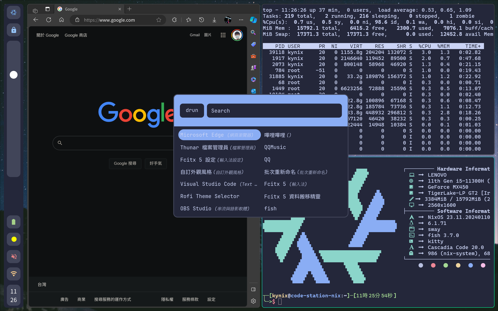

# Nix OS Configurations
<a href="../README.md">English</a> | 正體中文

## 預覽圖


## 簡介
我的NixOS Configurations檔案（使用flakes）

> **本檔案僅適用於2.5K熒幕，因爲其縮放策略僅適用上述熒幕。我將所有GTK應用程式強制運行在XWayland下，並應用XWayland的縮放策略使之縮放1.5倍，並通過調整DPI解決XWayland程式縮放模糊問題。** 

### 配置

| Key | Value |
|---|---|
| 處理器 | 11th Gen i5-11300H |
| 記憶體 | 16GB |
| OS | NixOS 23.11 |
| Kernel | 6.1.71 |
| 終端機 | kitty |
| Shell | fish |
| 顯示 | Wayland |
| WM | Hyprland |

### LICENSE
- MIT

## 安裝

1. 將本倉庫Clone到 `/etc/nixos/`:

```shell
sudo git clone git@github.com:KynixInHK/nix-config.git /etc/nixos/
```
2. 將你自己的 `hardware-configuration.nix` 拷貝到 `hosts` 資料夾中：

```shell
# Delete the origin file
sudo rm nix-config/hosts/hardware-configuration.nix

# Copy your own file
sudo cp ./hardware-configuration.nix nix-config/hosts/
```
3. 應用配置：
```shell
sudo nixos-rebuild switch
```